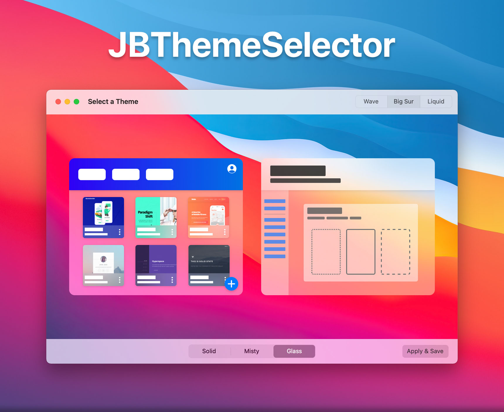
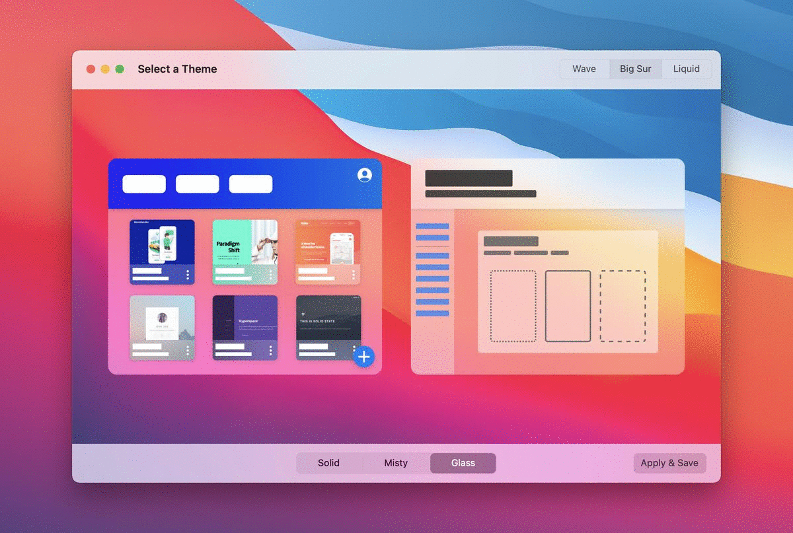

<b>JBThemeSelector</b> is a beautiful, dynamic Theme Selector for iOS and macOS.

Give your users a feel of the themes that are available to them, before they're even applied!

# Table of Contents
1. **[Implementation](#implementation)**
    1. [Overview](#overview)
    2. [Theme](#theme)
    3. [Theme Selector](#theme-selector)
    
2. **[Progress & TODO](#todo)**
    1. [Overview](#progress)
    2. [Up Next](#up-next)
    3. [Second Priority](#second-priority)
    4. [Packages](#packages)



# Implementation
As of right now, this project is more of a proof-of-concept. I do plan on implementing a simplified integration process, as well as creating [packages](#packages) for a quick and easy setup process.

I am currently in the middle of exam season with a few more assignments due until I can officially call it a semester. Furthermore, I have a number of projects in the works that are close to production (one of which is where I got the inspiration to create this standalone project). However, the lovely people of Reddit requested that I release the base code as soon as possible, regardless of the code's current state.

If anyone would like to help out, I would be more than happy to accept pull requests!

## Overview
Initially, I was planning on adding a full-on theme library – including UI elements, colors, the works. However, once Big Sur was released, I knew that Apple's UI standards were heading in a different direction. A number of applications (Music, Safari, Outlook,  etc.) have opted for the [VisualEffectView](https://developer.apple.com/documentation/appkit/nsvisualeffectview) theming scheme. Thus, I decided to go the same route and allow the user's system to decide.

### Theme
Theme implementation for AppKit's [NSVisualEffectView](https://developer.apple.com/documentation/appkit/nsvisualeffectview) with [Material](https://developer.apple.com/documentation/appkit/nsvisualeffectview/material):
```
enum Theme {

  case solid      // Opaque Background
  case misty      // Half & Half (Middle)
  case glass      // Translucent Blur
  
  var material: NSVisualEffectView.Material {
    switch self {
    case .solid: return .windowBackground
    case .misty: return .underWindowBackground
    case .glass: return .fullScreenUI
    }
  }
  
}
```
##### <ins>Use Cases</ins>

Setting VisualEffectView's Material property:

`visualEffectView.material = theme.material`

#### Additional Theme Properties
Determining if a view should have a clear or opaque background:
```
var isTransparent: Bool {
  switch self {
  case .solid: return false
  case .misty: return true
  case .glass: return true
  }
}

var backgroundColor: NSColor {
  switch self {
  case .solid: .white // .black
  case .misty: .clear
  case .glass: .clear
}
```
##### <ins>Use Cases</ins>

Setting the view's background (with [NSView+BackgroundColor extension](https://gist.github.com/revblaze/0b572ce78999916028f423866ebb1dc5)):
```
view.backgroundColor = theme.backgroundColor
```

Setting the VisualEffectView display `(.solid = isHidden) ? !isHidden`:
```
visualEffectView.isHidden = !theme.isTransparent
```

#### Full Example Usage
**macOS:** Setting the View and VisualEffectView properties.
```
func setTheme(_ theme: Theme) {
  view.backgroundColor = theme.backgroundColor
  visualEffectView.isHidden = !theme.isTransparent
  visualEffectView.material = theme.material
}
```
Note: If you need a more in-depth way of handling the macOS system appearance, checkout NSView's [hasDarkAppearance extension](https://gist.github.com/revblaze/bfe9969093fe60b181e14995b4eadfbc). You can use it to specify certain properties depending on if macOS is in default (light) or dark mode.


### Theme Selector
As I mentioned above, the project itself is not easy to import. Most of the UI presentation has been done through Storyboards. For now, you can follow these steps to import ThemeSelector:

(Back to studying, brb!)


## TODO
### Progress
- [x] Implement macOS interface
  - [x] Storyboard
  - [ ] Programmatic
  - [ ] Swift UI
- [ ] Implement iOS interface
  - [ ] Storyboard
  - [ ] Programmatic
  - [ ] Swift UI

### Up Next
- [ ] Create custom class for mini views
- [ ] Add how-to for implementation
- [ ] Add how-to for creating mini view thumbnails
- [ ] Simplify and improve code

### Second Priority
- [ ] Add more thumbnail view types
- [ ] CollectionView for adjustible number of windows
- [ ] Single cross-platform project
- [ ] More efficient use of VisualEffectView

### Packages
- [ ] Create Swift Package
- [ ] Create Podfile (?)

## Known Errors
None as of yet.

## References
None as of yet.

## Requirements
- Requires macOS 10.14 or later.
- Requires iOS 11 or later

<i>Please note that the app is being built with Swift 5.3</i>

## MIT License

Copyright © 2021 Justin Bush. All rights reserved.

```
Permission is hereby granted, free of charge, to any person obtaining a copy
of this software and associated documentation files (the "Software"), to deal
in the Software without restriction, including without limitation the rights
to use, copy, modify, merge, publish, distribute, sublicense, and/or sell
copies of the Software, and to permit persons to whom the Software is
furnished to do so, subject to the following conditions:

The above copyright notice and this permission notice shall be included in
all copies or substantial portions of the Software.

THE SOFTWARE IS PROVIDED "AS IS", WITHOUT WARRANTY OF ANY KIND, EXPRESS OR
IMPLIED, INCLUDING BUT NOT LIMITED TO THE WARRANTIES OF MERCHANTABILITY,
FITNESS FOR A PARTICULAR PURPOSE AND NONINFRINGEMENT. IN NO EVENT SHALL THE
AUTHORS OR COPYRIGHT HOLDERS BE LIABLE FOR ANY CLAIM, DAMAGES OR OTHER
LIABILITY, WHETHER IN AN ACTION OF CONTRACT, TORT OR OTHERWISE, ARISING FROM,
OUT OF OR IN CONNECTION WITH THE SOFTWARE OR THE USE OR OTHER DEALINGS IN
THE SOFTWARE.
```
